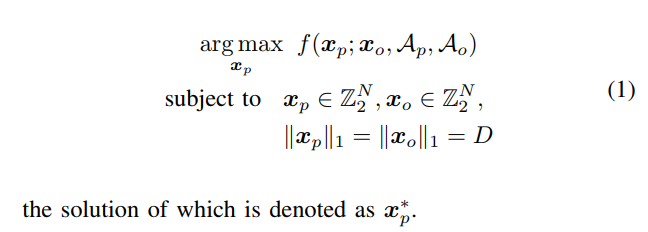
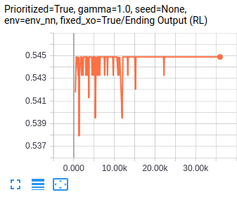

A Collectible Card Game (CCG) Deck Recommender just for fun. The project is still under construction and expected to complete in Sept, 2018.

The paper is available on arxiv: [Q-DeckRec: A Fast Deck Recommendation System for Collectible Card Games](https://arxiv.org/abs/1806.09771)

All deck recommendation codes are available under `combinatorial_search` directory.

<br>

### Overview

The paper tries to solve the following combinatorial optimization problem:


We mainly have three models: "rl_prtr" refers to Q-DeckRec, 'sl' refers to the ad-hoc baseline using Monte-Carlo simulations, and "ga" refers to Genetic Algorithm.

We prepare two sets of problem instances: "synthetic neural network"and "deck recommendation". The latter is the real problem on which we conduct experiments in the paper.

All commands below are assumed to be executed under the `combinatorial_search` directory.
#### Synthetic Neural Network Problems 

The synthetic neural network problem assumes f() is a function parameterized by a neural network. It also assumes x_o is fixed in all problem instances. Therefore, Q-DeckRec will learn a search policy to find the best x_p against the fixed x_o, while x_p is initialized randomly. This problem is the best starting point to experiment Q-DeckRec and other algorithms before moving to real deck recommendation problems.

Generate problems
```
# generate a problem where there are 20 total cards and deck size is 6
# the problem will be serialized in test_probs folder
# pv=0 means the index of the problem instance is 0. You can change 
# this index to create different problem instances.
python3.6 problem_generator.py --k=20 --d=6 --env=env_nn --pv=0 --env_seed=303
```

Before test `rl_prtr`, we need to generate a pre-training RL model
```
# the model will be saved in prtr_models/
python3.6 Q_comb_search.py --env_name="env_nn" --k=20 --d=6 --test_period=100 --load=0 --fixed_xo=1 --env_dir="test_probs/prob_env_nn_pv0_envseed303" --learn_wall_time_limit=5000 --root_dir="prtr_models"
# use tensorboard to check progress
tensorboard --logdir=prtr_models/rl_prtr_env_nn_k20_d6_t5000/
```

What you will see in tensorboard is:



x axis represents learning episode and y axis represents the win rate of x_p^d against x_o. The learned search policy will be more and more stable to approach the best x_p.


Test different methods
```
# final results will be stored in test_result.csv in the problem folder
python3.6 experimenter.py --method="rl_prtr" --prob_env_dir="test_probs/prob_env_nn_pv0_envseed303" --prtr_model_dir="prtr_models/rl_prtr_env_nn_k20_d6_t5000/optimizer_model_fixedxoTrue/qlearning"
python3.6 experimenter.py --method="ga" --wall_time_limit=5 --prob_env_dir="test_probs/prob_env_nn_pv0_envseed303"
```

#### Deck Recommendation Using MetaStone + GreedyMove AI
Generate problems
```
# the environment name is "env_greedymove"
# you can also refer to the script combinatorial_search/commands/env_greedymove/prob_generate.bash
python3.6 problem_generator.py --k=312 --d=15 --env=env_greedymove --pv=0 --env_seed=303
```

MC-simulation baseline
```
# collect training data. x: pairs of randomly generated (x_o, x_p), y: win rate
# --load=0 or 1 decides whether to load an existing dataset or not
# data collection will continues until reaching wall time limit (in seconds)
python3.6 supervise_learning.py --env_name="env_greedymove" --k=312 --d=15 --load=0 --wall_time_limit=2591000 
# test it and results will be stored in test_result.csv in the problem folder
python3.6 experimenter.py --method="sl" --prob_env_dir="test_probs/prob_env_greedymove_pv0_envseed303" --prtr_model_dir="prtr_models/sl_env_greedymove_k312_d15_t2591000" --wall_time_limit=2591000 --sl_num_trial=67
```

Report results
```
python3.6 report.py --env=env_greedymove
```

Test different methods: see different directories in `combinatorial_search/commands/env_greedymove/`

<br>

### File Structure in `combinatorial_search` directory

`commands`
slurm commands to run experiments

`environment`
Combinatorial Optimization environment set up. `shadow.jar` is the simulator for simulating Hearthstone matches controlled by greedy-based AI.
See https://github.com/czxttkl/metastone for how `shadow.jar` is generated.

`GA`
Contains an example implemented by [DEAP library](https://github.com/DEAP/deap)

`prioritized_exp`
A folder which contains all needed functions for prioritized experience replay (together with `prioritized_memory.py`)

`prtr_models`
Not checked in the repository. But this directory stores all trained models.

`resource`
Record what cards included in the simulator

`slurm`
Slurm outputs files for debugging

`test_probs`
Serialized test problems and test results

`experimenter.py`
A helper to evaluate different algorithms on test problem instances.

`experimenter_cpu_time.py`
A helper to evaluate CPU time usage of `experimenter.py`

`genetic_algorithm.py`
Helper code to implement genetic algorithm's mutate and crossover operators

`logger.py`
A logger helper to log test statistics on files.

`Q_comb_search.py`
A helper to kick off QLearning training. It allows the tuning of various hyperparamters.

`QLearning.py`
Implement Q-Learning with MLP-based function approximator. It has two main functions: `collect_samples` keeps trying different x_o vs. x_p and store experiences (s, a, r, s', a') into a prioritized experience replay; `learn` keeps using the stored experiences to update MLP paramters.

`random_search.py`
Randomly search for decks (each random deck needs a win-rate evaluation, which is costly)

`report.py`
Report tool. For example, you can use `python3.6 report.py --env=env_greedymove` to check the current results for the experiment in our paper.

`supervise_learning.py`
Learn a win-rate predictor and then use Monte Carlo simulation to sample random decks and pick the one with the highest predicted win rate

`supervise_learning_cpu_time.py`
Only for measuring CPU time of `supervise_learning.py`

`tfboard.py`
Tensorboard helper


<br>

### Requirement

Python 3.6. Please also see `requirements.txt`


Credits to https://github.com/jleclanche/fireplace
